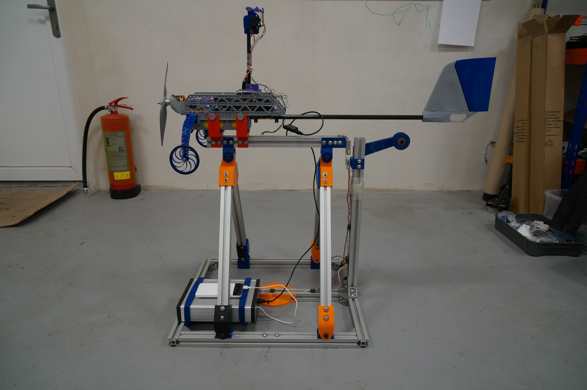

# TF-MOTORSCALE

Test bench for measuring parameters of propulsion system (propeller, motor, regulator) of unmanned drones

## Start measuring scripts

    sudo systemctl restart onboot

## Remote display

The computer which should display the measured data needs to have [TFROSTOOLS](https://github.com/ThunderFly-aerospace/TFROSTOOLS) installed.

    sudo apt install python3-colcon-common-extensions
    git clone git@github.com:ThunderFly-aerospace/TFROSTOOLS.git
    cd TFROSTOOLS/
    ./install.
    source install/setup.bash

Then the data should be displayed in the [PlotJuggler](https://github.com/facontidavide/PlotJuggler) on the remote computer.

    ros2 run plotjuggler plotjuggler

# Vyčítání parametrů z UAVCAN regulátoru

CAN převodník se přípojí příkazem:

    ./create_socket_can.sh

Následně se musí spustit ROS nod:

    ros2 run tf_tools uavcan_motor_driver
