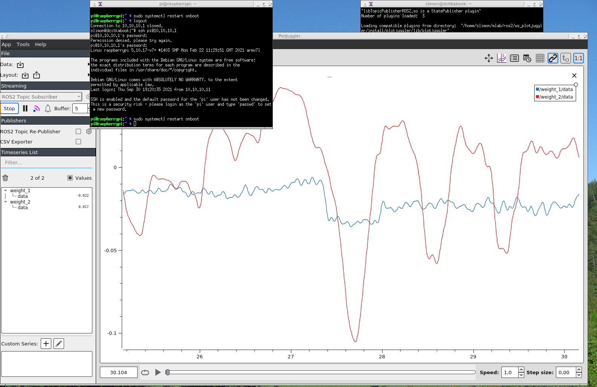

# TF-PROPSCALE - propulsion system test bench

*Formerly known as TF-MOTORSCALE* 

Test bench for measuring parameters and verification of propulsion system (propeller, motor, regulator) of unmanned drones especially [TF-G2 autogyro](https://github.com/ThunderFly-aerospace/TF-G2).


## Start measuring scripts

    sudo systemctl restart onboot

## Remote display

The computer which should display the measured data needs to have [TFROSTOOLS](https://github.com/ThunderFly-aerospace/TFROSTOOLS) installed.

    sudo apt install python3-colcon-common-extensions
    git clone git@github.com:ThunderFly-aerospace/TFROSTOOLS.git
    cd TFROSTOOLS/
    ./install.
    source install/setup.bash

Then the data should be displayed in the [PlotJuggler](https://github.com/facontidavide/PlotJuggler) on the remote computer.

    ros2 run plotjuggler plotjuggler




# Readout of parameters from UAVCAN ESC

CAN translator should be connected by following command:

    ./create_socket_can.sh

Then [ROS node](http://wiki.ros.org/Nodes) should be run by:

    ros2 run tf_tools uavcan_motor_driver
    
# Additional ROS nodes

```
ros2 run tf_tools gpsd
ros2 run tf_tools tfslot
ros2 run tf_tools uavcan_motor_driver
```
